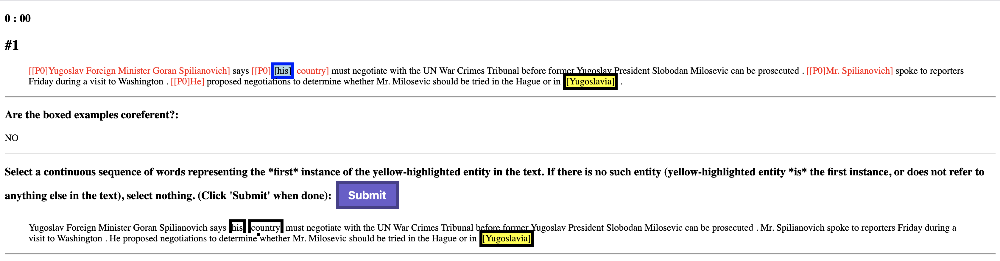

# Active learning for coreference resolution using discrete annotation
This is the corresponding code for the ACL 2020 paper, *Active Learning for Coreference Resolution using Discrete Selection*.

## Setup
1. Install Anaconda here: https://conda.io/projects/conda/en/latest/user-guide/install/index.html
2. Create a new environment: `conda create -n discrete_al_coref python=3.7`
3. Activate your environment: `conda activate discrete_al_coref`
4. Install all requisite libraries: `pip install -r requirements.txt`.


## Data
We use data from the English CoNLL-2012 coreference dataset, which can be obtained by following [this link](http://conll.cemantix.org/2012/introduction.html).

**Please modify `train_data_path`, `validation_data_path`, and `test_data_path` in `training_config/coref.jsonnet` to point to your download location.**


## Usage
### Simulating Training with Active Learning
To simulate active learning with discrete annotation, run
```
python run_train.py {index of CUDA device to run on (-1 for CPU)} \
    -e {save_dir} \
    -s {entropy/qbc{num_submodels}/score/random} \
    --labels_to_query {num_labels_per_doc} \
    [--save_al_queries]
``` 

To simulate active learning using pairwise entropy, score, or random selection
(Note: pairwise annotation does not yet support query-by-committee)
```
python run_train.py {index of CUDA device to run on (-1 for CPU)} \
    -p \
    -e {save_dir} \
    -s {entropy/score/random} \
    --labels_to_query {num_labels_per_doc} \
    [--save_al_queries]
```

To simulate active learning with **unclustered** selectors
```
python run_train.py {index of CUDA device to run on (-1 for CPU)} \
    -nc \
    [-p] \
    -e {save_dir} \
    -s {entropy/qbc{num_submodels}/score/random} \
    --labels_to_query {num_labels_per_doc} \
    [--save_al_queries]
```

Model checkpoints will be saved under `{save_dir}/checkpoint_{num_labels_per_doc}`. Results will be under `{save_dir}/{num_labels_per_doc}.json` and query information under `{save_dir}/{num_labels_per_doc}_query_info.json` (which can be used to compute annotation time).

Note for the `qbc` selector, you must additionally specify the number of submodels you wish to run with. For example, if you wish to run with 3 submodels, you should specify `qbc3` as the selector. If you wish to run with 5 submodels, specify `qbc5`, etc.

Also, you may set the `--save_al_queries` flag, which will save up to 10K queries per active learning iteration in `{save_dir}/saved_queries_epoch_{epoch}.json`.


### Launching Annotation Interface for Timing Experiments

To launch our discrete annotation interface and/or run your own timing experiments:
1. `cd timing_experiments`
2. Launch the server on an open port (i.e. 8080): `python server.py -p {port}`
3. Change the address on line 114 of `timing_experiments/experiment.js` to point to your server (i.e. `http://{your server address}/reciever`).
3. Serve the UI on another port: In another terminal window/pane, `cd` to `timing_experiments` again. In this window, run `python -m http.server {port2}` (where `port2 != port`).
4. Open a browser and navigate to `{your machine IP address}:{port2}/instructions.html` to begin the timing experiments.
5. After completing the timing experiments, the server will automatically save the user's timing results to a JSON file under `timing_experiments/timing_results`. These results are a list of actions, each of which take the form:
    ```
    [
        question number,
        user input (pair_yes/pair_no/discrete_submit),
        start time,
        end time,
        list of selected discrete tokens (if input was discrete_submit)
    ]
    ```
    a. If you wish to change the location of the save directory, modify line 12 in `timing_experiments/server.py`.

Alternatively, you may check out [the demo we have set up here](https://belindal.github.io/timing_experiments/). However, completing the experiments here will save the timing results to our server (if it is up).


## References
To cite our paper or code, please cite:
```
@InProceedings{li2020active,
    title={Active Learning for Coreference Resolution using Discrete Annotation},
    author={Belinda Li and Gabriel Stanovsky and Luke Zettlemoyer},
    year={2020},
    eprint={2004.13671},
    archivePrefix={arXiv},
    primaryClass={cs.CL}
    publisher = {Association for Computational Linguistics}
}
```
